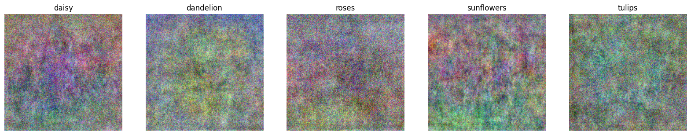
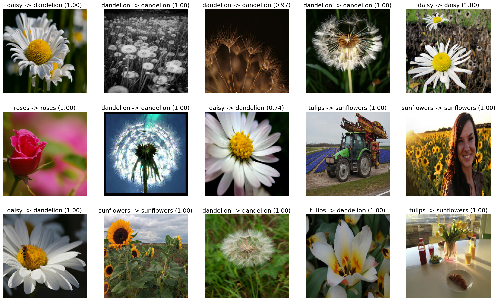
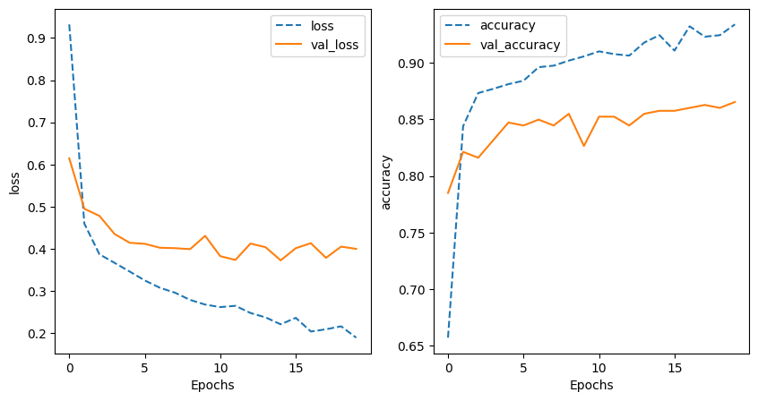
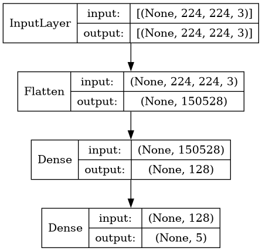

# Image Understanding with TensorFlow (GPC)

Este repositorio contiene los proyectos/laboratorios que realicé para el coursework de comprensión de imágenes con TensorFlow (Google Cloud Platform).

## Laboratorios realizados
A continuación, la lista de laboratorios que completé.

| Laboratorio |
| --- |
| Clasificando imágenes con un modelo lineal |
| Clasificando imágenes con un modelo NN y DNN |
| Clasificando imágenes con Transfer Learning |
| Clasificando imágenes usando Data Augmentation |
| Clasificando imágenes usando Dropout y Batch Normalization |
| Detectando etiquetas, rostros y puntos de referencia |
| Extrayendo texto de las imágenes |

## Vista previa de resultados

